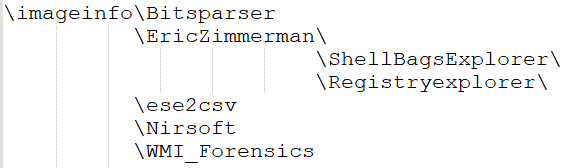

# Get-imageinfo.ps1 & Get-volcanoinfo.ps1

I am a firm believer in automation. Several years ago I began to create scripts to automate the data collection when doing computer forensics. Being lazy, I eventually started putting everthing in one big script. Over the years the script grew and other consultants I worked with began to use it. These scripts are the result of that process.

All of the data is contained in either csv or txt files making it easy to search. The original script was modified again to make the data easily importable into Splunk with a date field as the first field in a normalized format that Splunk understands. The scripts were never created with a plan. They just grew over the years with things patched on it.  The two scripts share most of the same code. The data is in different places for each so there is some differences.

Both scripts process the available information using mainly [Eric Zimmerman](https://ericzimmerman.github.io/#!index.md)'s and [Nir Sofer](https://www.nirsoft.net/)'s tools. There are a couple other tools used for specific information and some custom functions. The list below is most of the information that is collected. It also collects the event log files and the registry hives. All the information from a single host is in one directory named after the host. Each file is prefixed with host name. The processing is split into several modules - the main processing scipt, systeminfo, registry, userinfo, log files and IIS log files.

The **get-imageinfo.ps1** script is designed to process a mounted disk image. I have had the best luck with [ArsenalImageMounter](https://arsenalrecon.com/downloads/). To use the script cd to the folder you want to contain the data. Run

`PS> \pathtoscript\get-imageinfo.ps1 <mounted drive e.g. g:>`

The script will read the image, extract the computer name, create a folder with that name and begin processing. It starts a different process for log processing and IIS log processing because they can take a long time. Depending on the image it will take about 20 minutes to 4 hours to process. 

The **get-volcanoinfo.ps1** extracts much the same information from the volatile data collected by [Volexity Volcano Surge](https://www.volexity.com/products-overview/surge/). Run the script thusly:

`PS> \pathtoscript\get-volcanoinfo.ps1 <folder like 20210917115244>`

It will then look at the data retrieve the hostname and rename the folder to the hostname and proceed with processing.

There are multiple different Windows versions and the scripts look for and processes the data that is available.

### Host Information
- Am Cache
- Application Compatability Cache (Shim Cache)
- Jump List
- Link Files
- MFT
- Recycle Bin
- Prefetch
- Recent File Cache
- Shell Bags
- SRUM
- SUM
- Delivery Optimization Log
- Scheduled Tasks
- Group Policy
- WMI
- Bits Transfers
- Windows 10 History
- Browsing History
- Event Logs
  - Event Log Analysis
  - Log Tampering
  - Logon Analysis
  - New Services
  - New Tasks
  - Suspicious PowerShell Activity
  - Run - Runonce
  - WRM Activity
  - User/Group Changes
  - Pass-the-hash
  - Kerberosting
  - Zerologon
- 	Unquoted Service Paths
- IIS Logs
- DHCP Logs
- DNS Logs
- System, Software, Security, SAM Registry Hives
- Compiles System Information
- Configuration Audit
- Environment Variables
- Mounted Devices

### Per User
- NTUser.dat Registry Hive
- FireFox Downloads
- Chrome Cookies
- Chrome Cache
- Chrome History
- Edge Cookies
- IE Cache
- Mozilla Cache
- PowerShell Log
- Recent File Cache
- Recent Docs
- Recent Apps
- Trusted Documents
- User Assist
- Typed URLs
- MRU (Most Recently Used)
- Mapped Drives

## Setup

The scripts `get-imageinfo.ps1` and `get-volcanoinfo.ps1` require some external programs to run correctly. The location of these programs is set in process-lib.ps1, you are welcome to change them if you have them in another location. The script will run without any of the programs; it will skip it what it doesn't find and go on. I have found it easier to just leave them where they are. Let's assume you have the script in a directory called `\imageinfo\` the directory structure will look like this with the standard process-lib.ps1 setup.

## [Eric Zimmerman's tools](https://ericzimmerman.github.io/#!index.md)

The following executables should be in the EricZirmmerman folder:  
\EricZimmerman\RBcmd.exe  
\EricZimmerman\AmcacheParser.exe  
\EricZimmerman\AppCompatCacheParser.exe  
\EricZimmerman\jlecmd.exe  
\EricZimmerman\lecmd.exe  
\EricZimmerman\mftecmd.exe  
\EricZimmerman\pecmd.exe  
\EricZimmerman\recentfilecacheparser.exe  
\EricZimmerman\ShellBagsExplorer\SBECmd.exe  
\EricZimmerman\WxTCmd.exe  
\EricZimmerman\registryexplorer\recmd.exe  
	Custom batch cmd files are here also

## [Nir Sofer](https://www.nirsoft.net/)'s tools.

These files should be in the Nirsoft folder  
\Nirsoft\FireFoxDownloadsview.exe  
\Nirsoft\appcrashview.exe  
\Nirsoft\browsinghistoryview.exe  
\Nirsoft\ChromeCookiesview.exe  
\Nirsoft\ChromeCacheview.exe  
\Nirsoft\ChromeHistoryview.exe  
\Nirsoft\EdgeCookiesview.exe  
\Nirsoft\IECacheview.exe  
\Nirsoft\MozillaCacheview.exe

## [Bits DB Parser](https://github.com/fireeye/BitsParser)

File that should be in the BitsParser folder.    
\BitsParser\BitsParser.exe 

## [ese database dumper](https://github.com/MarkBaggett/ese-analyst)
This file should be in the ese2csv folder  
\ese2csv\ese2csv.exe

## [Python Scripts to find Persistence in WMI.](https://github.com/davidpany/WMI_Forensics)
These files should be in the WMI_Forensics folder - I have placed compiled versions there.  
\WMI_Forensics\CCM_RUA_Finder.exe
\WMI_Forensics\PyWMIPersistenceFinder.exe

## [Parse Group Policy File](https://github.com/PowerShell/GPRegistryPolicyParser)
A slightly modified verson is is in the root folder so it does not have to be installed as a module. Named parse-polfile.ps1
